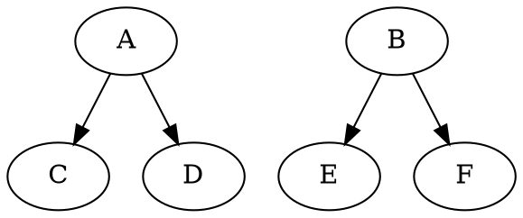

---
layout:
    post: true
title: Creating highly customizable HTML presentations with markdown and pandoc
excerpt: Presentations can be created using markdown, a plain file format. There are some available options, but let's see why it pays off to build your own solution.
last_modified_at: 2021-02-28

tags:
    - presentations
    - html
    - markdown
    - pandoc
    - graphviz
---
***Update 2021-02-28**: Instead of just having the template I have extracted a
[`markdown-presentation` package](https://github.com/danrot/markdown-presentation), which is used by the accordingly
updated [`presentation-template`](https://github.com/danrot/presentation-template). This allows to adjust styling
just once and have it in all my presentations, after updating the package using git submodules. I also got rid of the
graphviz integration and adjusted the `Makefile`, so that dot is only used if the files changed since the last
generation, which allowed to shorten the build time by a lot if diagrams have already been generated. Read more about
[this extraction and the improved build step in another
blog](/2021/03/06/use-git-submodules-and-make-for-simple-code-sharing.html).*

***Warning**: This is a rather long blog post explaining also some details. If you are just interested in the end result
you might want to jump the the [conclusion](#conclusion) right away*

I love [markdown](https://daringfireball.net/projects/markdown/). It's super easy to write, and also very easy to read,
making it a great tool to write e.g. blogs like this one. Since markdown is written using plain text files, it has
another bunch of advantages too:

- It can be easily versioned using other tools like `git`
- It is guaranteed that the content will still be accessible in many years, without worrying about file format
incompatabilities
- Tools like [pandoc](https://pandoc.org/) enable us to convert it to many different output files

I have especially fallen in love with pandoc, so that I ended up also writing my master thesis using markdown and
pandoc. And of course as a daily [GitHub](https://github.com) user I am using markdown a lot. It is used when writing
issues, PRs, comment on any of these things and even in repositories markdown files are parsed and shown nicely
formatted. GitHub has even created its own flavour of markdown and
[a guide on mastering markdown](https://guides.github.com/features/mastering-markdown/), another indicator of the
importance of this language to this company.

Then I stumbled upon this tweet of [Max Stoiber](https://twitter.com/mxstbr), which sounded interesting. A NPM package
that allows to write slides in markdown and afterwards serve them via a webserver using
[Gatsby](https://www.gatsbyjs.org/) under the hood.

> How to quickly create a talk from scratch 🔥
>
> 1. Write outline with markdown
> 2. Install mdx-deck by [@jxnblk](https://twitter.com/jxnblk?ref_src=twsrc%5Etfw)
> 3. Add --- and <Notes /> in the right places to split outline into slides
>
> Done! It does not get faster than presenting your outline 💯
>
> --- Max Stoiber ([@mxstbr](https://twitter.com/mxstbr)) [December 1, 2019](https://twitter.com/mxstbr/status/1201186612203466752?ref_src=twsrc%5Etfw)

## First steps with mdx-deck and its obstacles

That sounded great, so I decided to give it a try. The setup went really smooth, and it didn't take very long to create
the first slides. There was an
[annoying issue that crashed the watch mode](https://github.com/jxnblk/mdx-deck/issues/623), but they seemed to be
working on that, so I still decided to give it a try and used it to create the slides for a React lecture I am
currently giving. It worked quite well at the start, but it always felt a little bit strange... Probably the weirdest
thing for me as a minimalist was that a lot of functionality required to put some JavaScript into the markdown file,
which I so desperately wanted to keep clean:

- MDX allows to [render React components in markdown](https://github.com/jxnblk/mdx-deck#using-mdx)
- Using themes
[requires an `import` and `export` statement in markdown](https://github.com/jxnblk/mdx-deck/blob/master/docs/theming.md)

The pure concept of having any kind of code in a human-readable file format --- except if the code itself is what you are
writing about --- gave me a very bad gut feeling. It eliminated 2 out of 3 advantages I initially mentioned! However, I
accepted it for quite some time, but then more issues piled up:

- For some reason the watch task only reacted on the first change I made to a file. Subsequent changes were ignored.
- Starting the build or watch task took almost half a minute.
- I was not able to set a padding on code blocks in the presentation. Somehow the used syntax highlighter added some
inline styling I was not able to override (not even with `!important`).

All of this was very annoying, but embedding images was the final straw. I wanted to do it the markdown way:

```markdown

```

[But that does not seem to work with mdx-deck.](https://github.com/jxnblk/mdx-deck/issues/401) A tool for preparing
presentation slides, that did not even support embedding images? To be fair, there
[was a workaround suggested](https://github.com/jxnblk/mdx-deck/issues/401#issuecomment-513338816), but importing the
image and writing the `img` tag on my own in my markdown file was not acceptable to me. I've had accepted (for some
reasons I don't understand anymore) the use of JavaScript in other places mentioned above, but using JavaScript to
embed an image was just too much for me.

As a JavaScript developer it felt great to use the tools we are using every day to also deliver presentations. But at
this point it just seemed way to bloated for a relatively easy task. And then it hit my mind: Why don't I use pandoc,
which I also liked when writing my thesis? So I took about 1.5 hours (right before my lecture) and decided to give it a
try. And that was enough time to come up with a solution, that was almost as good as mdx-deck, but I didn't have to
pollute my markdown with JavaScript code. As a nice side effect the complete build of the same presentation takes now
300ms instead of almost 30s (sic!). Minimalism wins again!

## Using plain markdown, pandoc and a few lines of code instead

I've first had a quick look at the pandoc documentation and found a
[section about producing slide shows](https://pandoc.org/MANUAL.html#producing-slide-shows-with-pandoc). It supports
different ways of creating slide shows, but none of them suited me for different reasons. Especially that most of them
couldn't be installed via a package manager was odd. And I certainly didn't want to own the code and copy it into my
repository. Additionally, when you think about it, producing a HTML slide show is not very hard. Basically it is
styling it in some way that a slide fits exactly the size of the screen, and two event handlers to navigate to the next
or previous slides. So I've decided to build that on my own and published it as a
[presentation-template on GitHub](https://github.com/danrot/presentation-template). I am still going to run through the
most important points.

First of all I had to convert the file I called
[`slides.md`](https://github.com/danrot/presentation-template/blob/b44930c/slides.md) written using
[pandoc's flavour of markdown](https://pandoc.org/MANUAL.html#pandocs-markdown) to HTML. This is as easy as executing
the following command --- assuming you have pandoc already installed:

```bash
pandoc\
    slides.md\
    -o slides.html\
    -s\
    --self-contained\
    --section-divs\
    -c slides.css\
    -A slides_before_body.html
```

The `pandoc` command takes the name of the markdown file as first parameter, and will automatically recognize to which
format it should be converted by checking the file extension of the `-o` option representing the output file. Usually
`pandoc` would only create a document fragment, but by adding the `-s` flag it will also include everything a proper
HTML document needs, like `html`, `head` and `body` tags. In order to distribute the file without much hassle I have
added the `--self-contained` flag, which will cause to inline all styles and scripts instead of just referencing them.
The `--section-divs` will wrap every header in markdown in a `section` tag along with its content. So everything until
the next heading of the same level will be included in that `section`. This is an enormous help when trying to style
the presentation! Finally the `-c` option refers to the file containing the CSS, which is called
[`slides.css`](https://github.com/danrot/presentation-template/blob/b44930c/slides.css) in my case and does not contain
anything except for plain old CSS, and the `-A` option to inject another HTML file called
[`slides_before_body.html`](https://github.com/danrot/presentation-template/blob/b44930c/slides_before_body.html) right
before the closing body tag. All this HTML file contains is a few lines of JavaScript, which enable the user of the
presentation to go back and forth using the arrow keys. For this it will collect all `section` tags with an `id`, so
that they can be used as an anchor by just setting the
[fragment of the URL](https://en.wikipedia.org/wiki/Fragment_identifier). It will also add an empty fragment as the
first available fragment, because the title slide does not get it's own `section`.

```html
<script>
const availableSlides = [...document.querySelectorAll('section[id]')]
    .map((element) => '#' + element.id);
availableSlides.unshift('#');

function goToSlide(number) {
    if (availableSlides[number]) {
        location = availableSlides[number];
    }
}

document.addEventListener('keydown', function(event) {
    const currentSlide = availableSlides.findIndex(
        (availableSlide) => availableSlide === (location.hash || '#')
    );

    switch (event.key) {
        case 'ArrowLeft':
            goToSlide(currentSlide - 1);
            break;
        case 'ArrowRight':
            goToSlide(currentSlide + 1);
            break;
    }
});
</script>
```

So by just using three different files (
[slides.md](https://github.com/danrot/presentation-template/blob/b44930c/slides.md),
[slides.css](https://github.com/danrot/presentation-template/blob/b44930c/slides.css) and
[slides_before_body.html](https://github.com/danrot/presentation-template/blob/b44930c/slides_before_body.html)) and
the `pandoc` command we already have a pretty nice HTML presentation, which --- unless for the HTML markup at which
`pandoc` does an excellent job --- we have full control over. There is no third party script adding some inline styles
that causes troubles when styling the presentation, and building the presentation is a matter of a few hundreds
milliseconds instead of waiting for half a minute. This even makes the watch task obsolete, especially because it is
also easily possible to grasp the structure of the presentation when looking at the markdown source as well.

I could have stopped there, but there was one more thing I was really keen on including into my presentation-template,
so that I digged bit deeper and invested about 2 more hours: I wanted to be able to include diagrams in my markdown
file by using the [`dot` language of graphviz](https://www.graphviz.org/). You can imagine the `dot` language to be the
markdown of diagrams, using an easy-to-write and easy-to-read syntax to describe diagrams. Since it is so easy-to-read,
it felt like the perfect candidate for being embedded in markdown. I imagined that somehow like this:

<!-- markdownlint-disable code-fence-style -->
~~~markdown
## My slide using a SVG diagram


~~~
<!-- markdownlint-enable code-fence-style -->

And after asking on [StackOverflow](https://stackoverflow.com/questions/60854853/integrate-graphviz-into-pandoc) if
this was possible, I was redirected to the
[`diagram-generator` lua-filter](https://github.com/pandoc/lua-filters/tree/master/diagram-generator#graphviz). It
looked very promising, but it did a little bit more than I needed, and since I like to keep things minimal I've copied
it and adjusted it:

```lua
local dotPath = os.getenv("DOT") or "dot"

local filetype = "svg"
local mimetype = "image/svg+xml"

local function graphviz(code, filetype)
    return pandoc.pipe(dotPath, {"-T" .. filetype}, code)
end

function CodeBlock(block)
    local converters = {
        graphviz = graphviz,
    }

    local img_converter = converters[block.classes[1]]
    if not img_converter then
      return nil
    end

    local success, img = pcall(img_converter, block.text, filetype)

    if not success then
        io.stderr:write(tostring(img))
        io.stderr:write('\n')
        error 'Image conversion failed. Aborting.'
    end

    return pandoc.RawBlock('html', img)
end

return {
    {CodeBlock = CodeBlock},
}
```

This code will convert all fenced code blocks with the `graphviz` annotation you've seen in my example above into a SVG
string, which in turn can be embedded in the HTML element. Awesome!

All that was left to do was to include this filter in the `pandoc` command using the `--lua-filter` option:

```bash
pandoc\
    slides.md\
    -o slides.html\
    -s\
    --self-contained\
    --section-divs\
    --lua-filter=codeblock-filter.lua\
    -c slides.css\
    -A slides_before_body.html
```

Since this command is not that rememberable I went old school and put it into a
[Makefile](https://github.com/danrot/presentation-template/blob/b44930c/Makefile). Writing such a `Makefile` is not
that hard, and `make` is installed on almost every linux machine anyway.

## Conclusion

So in conclusion it took me maybe 4 hours to find solution, which is probably less time I already tried to work around
some issues of mdx-deck. Summarized this solution also has other advantages:

- Performance is a lot better (build time of 300ms compared to 27s) making a `watch` task obsolete
- Fully customizable by CSS, with the only conflicts being the ones you generate on your own
- About 20 lines of JavaScript allow to navigate through the presentation using the arrow keys
- About 30 lines of Lua allow to inline graphviz documents and include them as inlined SVG into the presentation

I have to admit that I had to include a few lines of code in the presentation-template, but it is not much. And, more
importantly, it is outside of my markdown file, and that's where it belongs.

Feel free to have a look at my [presentation-template](https://github.com/danrot/presentation-template) and adjust it
to your needs.
